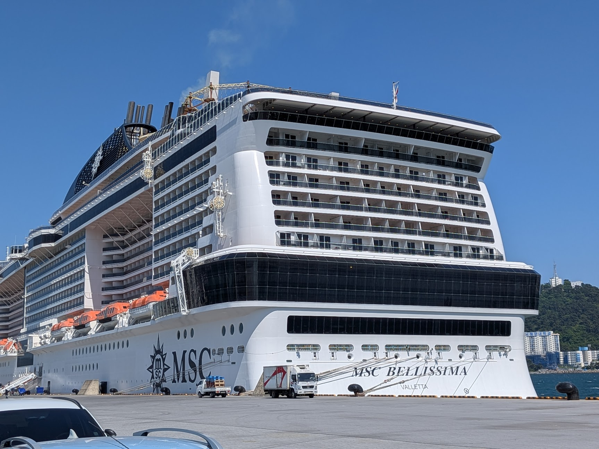

*[English version here](index.qmd)*

[MSC Bellissima](https://www.cruisecritic.com/cruise/msc/msc-bellissima) の日本・韓国周遊に乗ったあと、以前乗った [Norwegian Prima](https://www.ncl.com/cruise-ship/prima) の大西洋横断と何度も比べていた。率直に言うと、NCL Prima の方がかなり良かった。

ただし、面白いのは「MSC が悪くて NCL が良い」という単純な話ではないことだ。体験を分解すると、少なくとも3つの層が重なっていた。

- 船会社の運営思想
- 航路と日数の設計
- その航路を支えるクルーズ市場の成熟度

自分の好みから見ると、この3層すべてが NCL の大西洋横断では良い方向に働き、MSC Bellissima Japan では悪い方向に働いた。

## 一行で言うと

MSC Bellissima は悪い船ではない。だが、大型船、短期アジア航路、固定ダイニング、多言語運用、高密度レジャーという組み合わせが、自分の苦手なクルーズ体験をかなり正確に作っていた。

## 食事: 自由か、割り当てか

まず違ったのは夕食だった。

NCL の freestyle dining は自分に合っていた。固定席ではない。固定時間でもない。その日の気分で、いつ食べるか、どこに座るか、どれくらい人と関わるかを決められる。

MSC Bellissima はもっと伝統的だった。夕食は時間と席が決まる。儀式感や予測可能性が好きな人には合うと思う。しかし自分には、浮かぶリゾートというより、大規模に管理されたツアーの一部のように感じられた。

ビュッフェはその感覚をさらに強めた。数千人規模の船では、ビュッフェはプロダクト全体の負荷試験になる。混んでいて、騒がしく、座る場所を探すのに苦労すると、船はリゾートではなくショッピングモールのフードコートに近づく。

NCL Prima に混雑がないわけではない。大型船である以上、これは常に問題になる。それでも Indulge Food Hall や自由度の高い食事設計のおかげで、「処理されている」より「自分で選んでいる」と感じる瞬間が多かった。

## サービス: cheerfulness は重要

次に違ったのはサービスの温度だ。

NCL では、サービス文化がより積極的で cheerful に感じられた。スタッフがこまめに様子を見に来る。基本姿勢が「楽しめていますか？」に近い。

MSC Bellissima でサービスがなかったわけではない。料理は出る。依頼にも対応してくれる。ただ、標準エリアで感じた限りでは、そこにもう一層の温かさが薄かった。

ここには、日本航路特有の staffing constraint もあると思う。日本航路では、英語が得意ではない乗客も多い。そうすると、英語圏中心の大西洋横断よりも、多言語対応できることがスタッフ配置で重要になるはずだ。それ自体は理解できる。ただ、その tradeoff は見えた。何人かのスタッフは、このサービス環境にまだ十分慣れていないように見えたし、メニュー内容への理解も薄い場面があった。言語、メニュー理解、サービス成熟度が同時に少しずつ薄くなると、コミュニケーションはうまく噛み合わなくなる。

これはスタッフ個人を責める話ではない。これも航路設計の問題だ。多言語・短期・アジア航路のクルーズは、英語圏中心の長期航路よりも、乗客との interface 問題が難しい。

これはホテルよりクルーズで大きく効く。陸上なら、建物を出れば気分を切り替えられる。船ではサービス文化そのものが空気になる。手続き的に感じると、船全体が手続き的に見えてくる。

## 空間: 船か、モールか

3つ目は、公共空間の感触だった。

MSC Bellissima は見た目には立派だ。大きく、磨かれていて、アクティビティも多い。ただ、自分が欲しかったのは、静かに座り、本を読み、コーヒーを飲み、海の上にいる感覚を味わえる場所だった。そういう場所は思ったより見つけにくかった。

これは細かいが重要な違いだ。クルーズ船は、エンタメ装置として設計することもできるし、ゆっくり滞在する場所として設計することもできる。Bellissima は前者に寄っていた。中央プロムナード、商業的な動線、混み合うビュッフェが、船を密度の高い商業空間に見せていた。

Prima にも設計上の弱点はある。venue が小さく感じる場所もあった。それでも大西洋横断では海上日が多く、リズムが遅い。船が「過ごす場所」になる時間があった。

## 隠れた層: 航路設計

船そのものと同じくらい、航路も大きかったと思う。

大西洋横断は海上日が中心だ。船は港から港へ移動する手段ではなく、船そのものが目的地になる。だから、ゆっくり過ごし、会話し、本を読み、船上で生活することに慣れた乗客が集まりやすい。

短期の日本・韓国周遊は違う。主役は寄港地だ。船は移動するホテル兼エンタメ装置になりやすい。初クルーズ客、家族、団体、効率よく観光地を回りたい人が増える。

どちらが正しいという話ではない。ただ、作られる空気が違う。

自分の好みははっきりしている。長い海上日、英語で自然に会話できる環境、静かな routine、そして「何もしないこと」がクルーズの価値として許される文化が好きだ。

## 市場成熟度の問題

もう一つ、市場の成熟度という層がある。

欧米のクルーズ市場には、何十年分の共有された期待がある。乗客は自分が何を買っているかを知っている。船会社も、食事、ラウンジ、ショー、海上日の過ごし方、活動と静けさのバランスを磨く時間があった。

アジアのクルーズは、まだ mass market product として発展中だ。短期の地域航路では、クルーズが団体旅行の延長になりやすい。効率的で、高密度で、多言語で、寄港地中心で、運用が複雑になる。

多言語対応は表面的な問題ではない。船内放送、メニュー、食事中の質問、寄港地ロジスティクス、クレーム対応まで、サービスの表面全体が言語境界をまたぐ。運用側が language coverage を重視してスタッフを組むなら、NCL の大西洋横断で感じたような polished cruise-service maturity とは、選抜軸が少し変わる可能性がある。

この mismatch がかなり説明してくれる。MSC Bellissima Japan は単なる船ではなく、まだ「クルーズ時間」の意味を学んでいる市場に投入された船だった。

## MSC への最終判決ではない

だから、MSC を完全に除外するつもりはない。

MSC Yacht Club なら、静かな空間、良いサービス、混雑の少なさ、保護された船上リズムといった問題の多くを回避できるかもしれない。地中海の長めの航路なら、短期アジア航路とはまったく違う体験になる可能性もある。

つまり教訓は「MSC はやめろ」ではない。もっと精密に言うとこうだ。

> クルーズ会社を評価するときは、船、客室クラス、航路の長さ、乗客層、市場文脈を分けて考えるべきだ。

自分にとって、MSC Bellissima + 標準エリア + 短期日本・韓国航路という組み合わせが、合わない stack だった。

## 次に予約するなら

今回で、自分のクルーズ選びのフィルタはかなりはっきりした。

重視すべきもの:

- 自由度の高い dining
- 長い海上日
- 静かな lounge や cafe 的空間
- 英語で自然に会話できる環境
- 細かい追加課金のストレスが少ないこと
- 成熟したクルーズ文化

この条件なら、リポジショニングクルーズ、大西洋横断、Viking Ocean、Holland America、Celebrity、NCL、Virgin Voyages、あるいはいずれ Cunard Queen Mary 2 などが候補になる。MSC に再挑戦するなら、Yacht Club か、かなり違う航路にすべきだと思う。

大きな学びは単純だ。クルーズは船だけではない。ひとつの operating system だ。同じ船体でも、航路と買うレイヤーによって、豪華にも、混沌にも、社交的にも、孤独にも、休まるものにも、疲れるものにもなる。

MSC Bellissima は、自分にとって有用な negative data point になった。旅には、そういう役割もある。

## Further Reading

- [Cruise Critic: MSC Bellissima Review](https://www.cruisecritic.com/cruise/msc/msc-bellissima)
- [Norwegian Cruise Line: Norwegian Prima](https://www.ncl.com/cruise-ship/prima)
- [Cruise Critic: Norwegian Prima Review](https://www.cruisecritic.com/cruise/norwegian-ncl/norwegian-prima)
